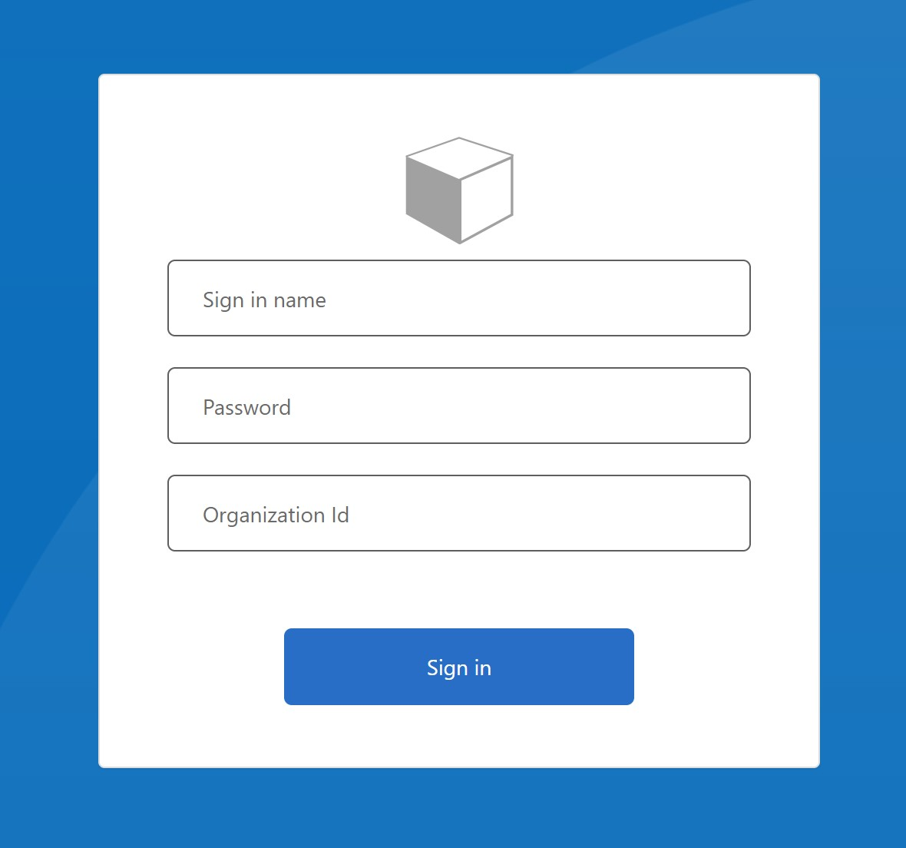
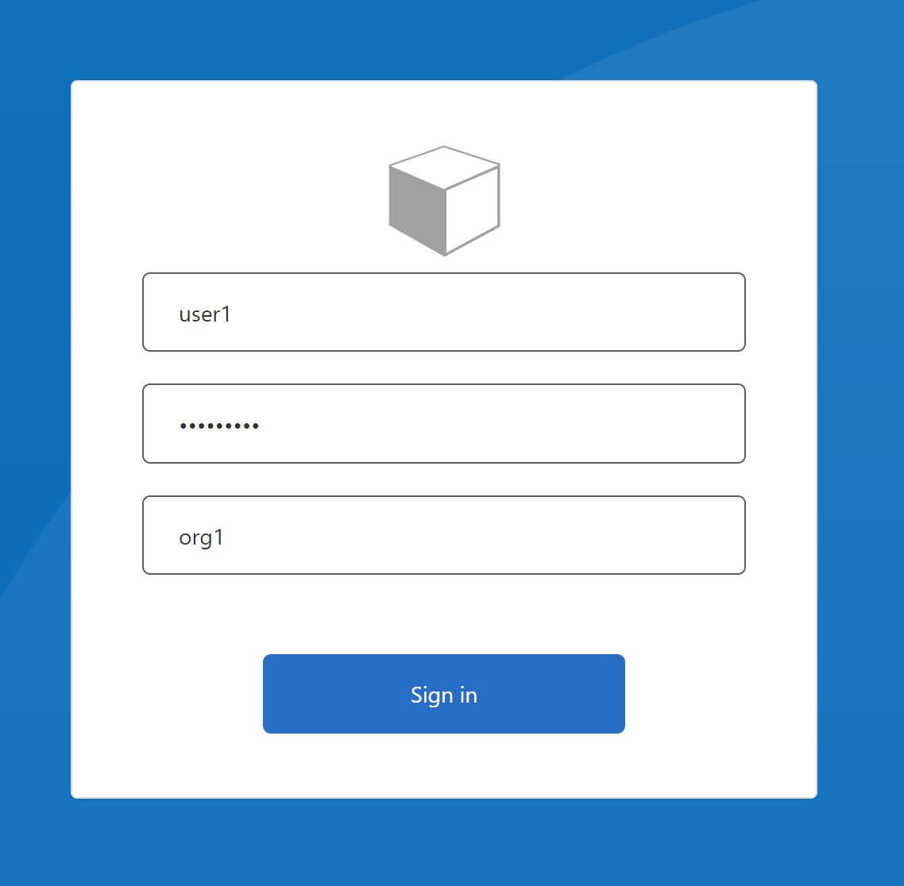
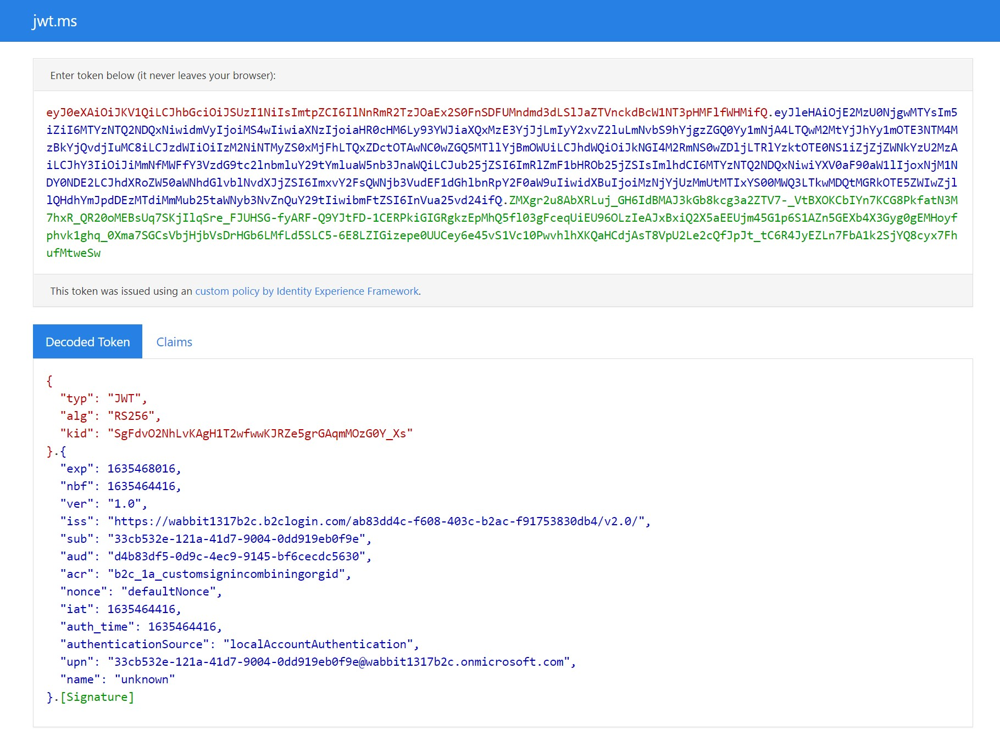

# Sign-in with Username prefixed with an Org ID

An Azure AD B2C custom policy using a custom sign-in page where users are able to enter their sign-in username, password and organization identifier to login with their B2C local account. 

To run this sample, you'll need to be set up with the [B2C starter pack](https://github.com/Azure-Samples/active-directory-b2c-custom-policy-starterpack). 

